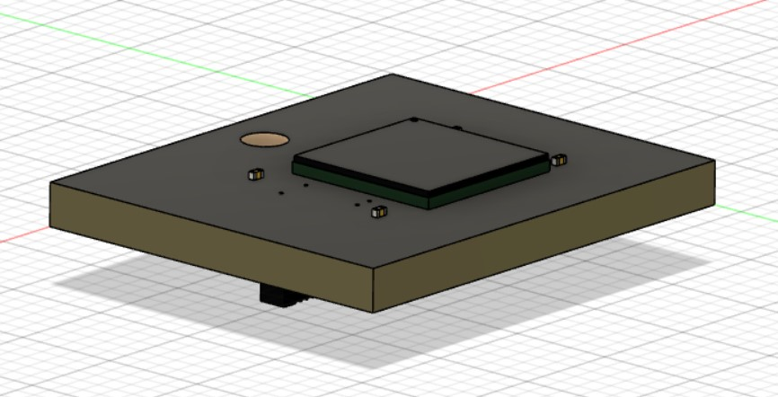
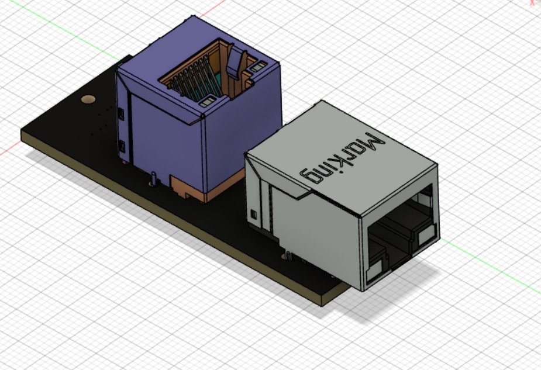
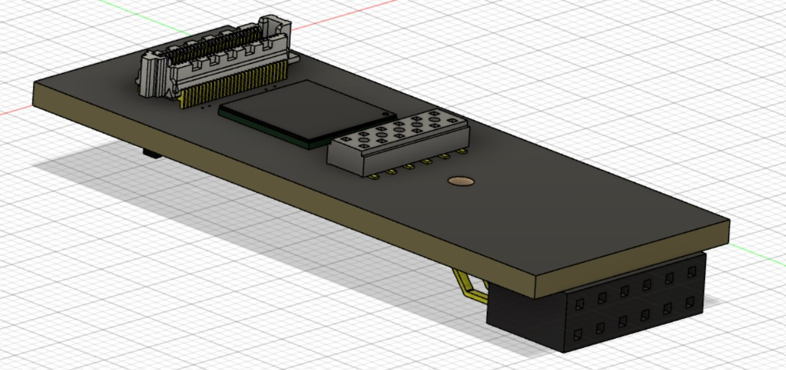

# CRUVI Extensions
## HS Extensions
### Finished
- Camera and HDMI
### In Development
- SDRAM (W9864G6JT-6 like on the Core)

- 2x Ethernet 10/100 Mbit

- Microcontroller (Same as TEENSY 4.0, HS and LS connector on top -> stackable)

### Ideas
- Gigabit Ethernet
- PCIe
- M.2 SSD socket
- USB C Thunderbold 3/4 controller

## LS Extensions
### Finished
- Motor
- Level Shifter
- Audio
### In Development

### Ideas
- MOSFET Power Switch
- EEPROM
- CAN
- Gyroscope/Accelerometer
- Compass
- Bluetooth
- ESP32/WLAN
- RFID
- NFC
- GPS
- Stepper Motor Driver
- Servo connnection
- Real Time Clock
- IR receiver/emitter
- Temperature/Humidity/Gas
- MEMS Microphone
- SD card

# CRUVI Development Boards
### Finished
- MAX10
- MAX10 Ultra
### In Development

### Ideas
- With Cyclone V SoC like DE10-Nano 

# CRUVI Shield
### Finished
- MAX10 Shield
### In Development

### Ideas
